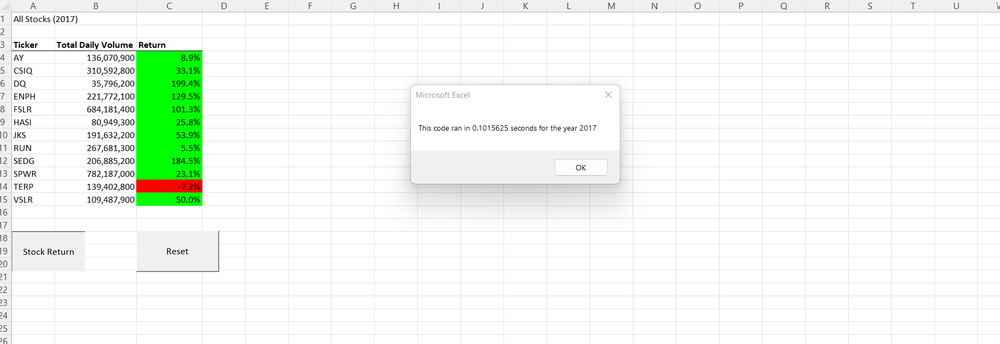
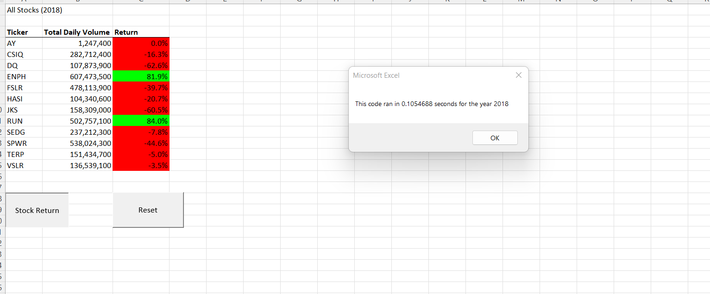

# Stock-Analysis

## Overview of the Project

Steve an fresh finance graduate would like to help his parents with their investments in  green energy corporations. He wants to diversify their income in different
engergy stocks to get good return on investment. To do so Steve needs a clear data analysis report that is generated by analyzing the stock volume and their returns
in past years. 

### Purpose of the Project

- The Stock data of various green energy corporations is being analyzed and compared to produce the results through which Steve can pick on the stocks to be invested
that can provide considerable return on investments.

- To generate Returns of the corporations the powerful **Macro** functionality of the Excel is being used. The **VBA** helps in automating the task of performing 
redundant actions and operations on the stock data. 

- The main purpose of the project is to produce the automated stock analysis of data for the years 2017 and 2018 with less execution time and higher efficiency.
This is achieved through *Refactoring of the VBA code*.

### Results

From the below snippets of the Data Analyzed it can be interpreted that

- In 2017 11 out of 12 stocks have given postive return whereas in 2018 performance of the stocks has been declined with an exception of stocks ENPH and RUN. 
- Based on the outcome except ENPH and RUN other stocks are not a good option for long term investment.

**2017 Stock Analysis Data after Refactoring**

**2018 Stock Analysis Data after Refactoring**

### Summary
#### Pros
  - Refactoring of the code gives a readable and understandable code
  - It gives Less Execution time 
  - Bugs can be identified easily as the code is structured.
#### Cons
 - It is tedious to refactor the code than to write from the scratch
 - As it is time consuming delivery timeline can be impacted
 
 ### Conclusion after Refactoring the Stock Analysis code
  - After refactoring the code the execution time has been drastically decreased from nearly 0.7 seconds to 0.1 seconds. This gives a major advantage when there are multiple programs running sharing the same CPU time. However it took same amount of time to refactor the code as it would have taken to write the code from the scratch
  
